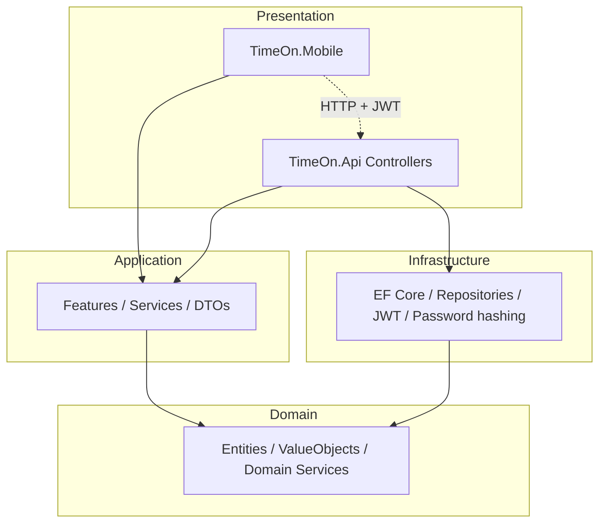
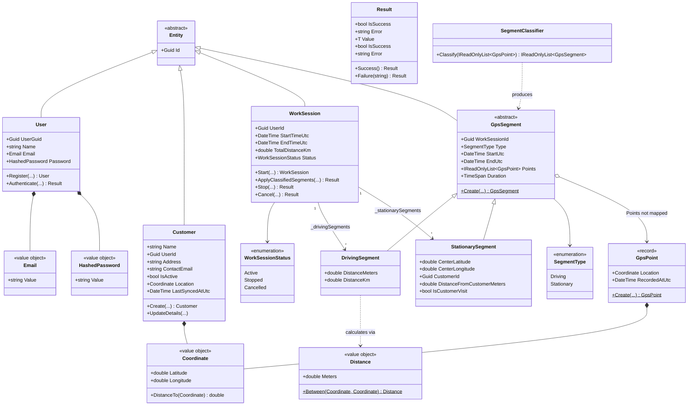
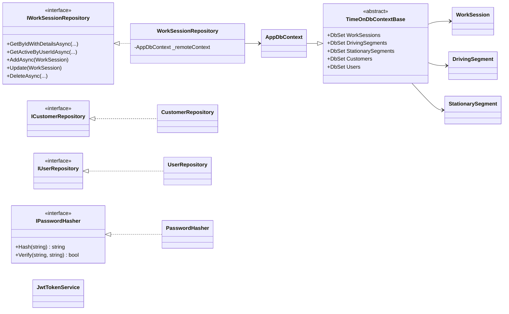
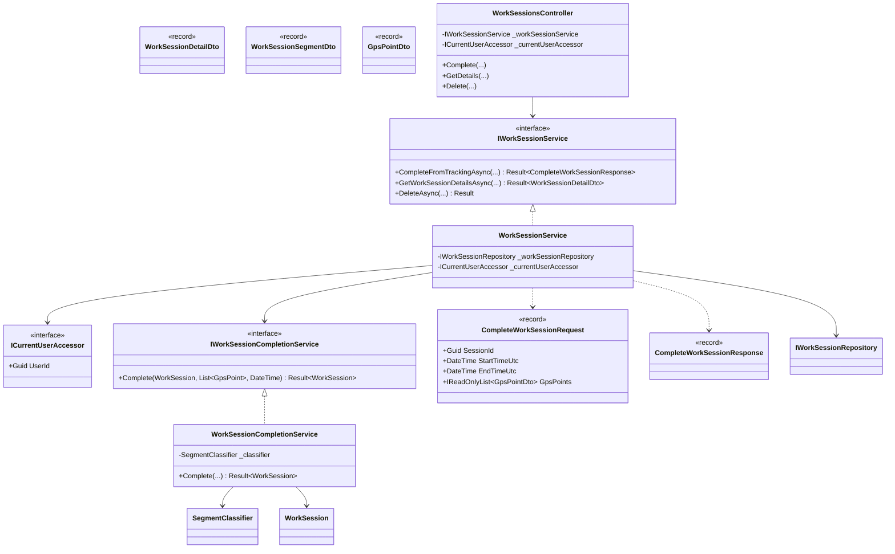
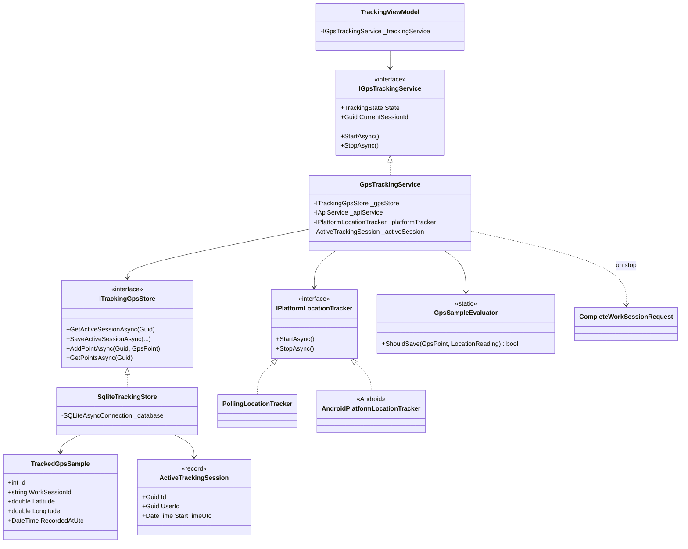
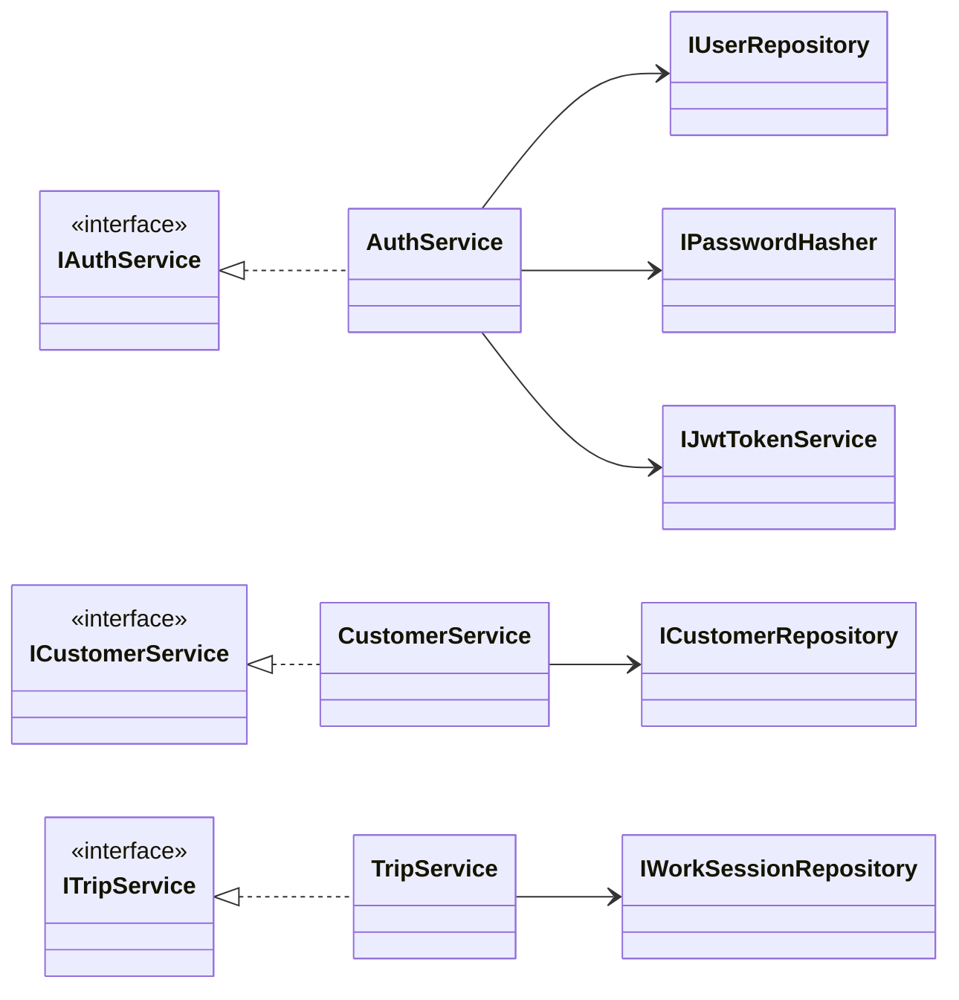

# TimeOn Architectuur — Klassendiagrammen

Klassendiagrammen voor de huidige solution-structuur (`TimeOn.Domain`, `TimeOn.Application`, `TimeOn.Infrastructure`, `TimeOn.Api`, `TimeOn.Mobile`).

**Laatst bijgewerkt:** juni 2026

---

## Solution-lagen

---

## Domain

---

## Domeininterfaces en infrastructuur

---

## Application (Worksession)

> **Opmerking:** `IWorkSessionCompletionService` / `WorkSessionCompletionService` zijn geregistreerd in DI en gedekt door unittests; koppel het constructorveld in `WorkSessionService` als het project nog niet compileert.

---

## Mobile — GPS-tracking

---

## Application

---

## Belangrijke ontwerpkeuzes

| Onderwerp      | Keuze                                                                   |
| -------------- | ----------------------------------------------------------------------- |
| Aggregate root | `WorkSession` bevat rij- en stilstaande segmenten                       |
| GPS-opslag     | Ruwe punten alleen op apparaat; API slaat geclassificeerde segmenten op |
| Klantbezoek    | `StationarySegment` met `CustomerId`                                    |
| Classificatie  | `SegmentClassifier` in Domein; afronding georkestreerd in Applicatie    |
| Authenticatie  | `User`-entiteit + JWT; `ICurrentUserAccessor` in API-pipeline           |

---

## Bronbestanden

| Gebied          | Pad                                                                   |
| --------------- | --------------------------------------------------------------------- |
| Entiteiten      | `src/TimeOn.Domain/Entities/`                                         |
| Value objects   | `src/TimeOn.Domain/Objects/` (namespace `TimeOn.Domain.ValueObjects`) |
| Classifier      | `src/TimeOn.Domain/Services/GpsClassifier.cs` (`SegmentClassifier`)   |
| Applicatie      | `src/TimeOn.Application/Features/`                                    |
| Persistentie    | `src/TimeOn.Infrastructure/Persistence/`                              |
| Mobile tracking | `src/TimeOn.Mobile/Features/Tracking/`                                |
| API             | `src/TimeOn.Api/Controllers/`                                         |

