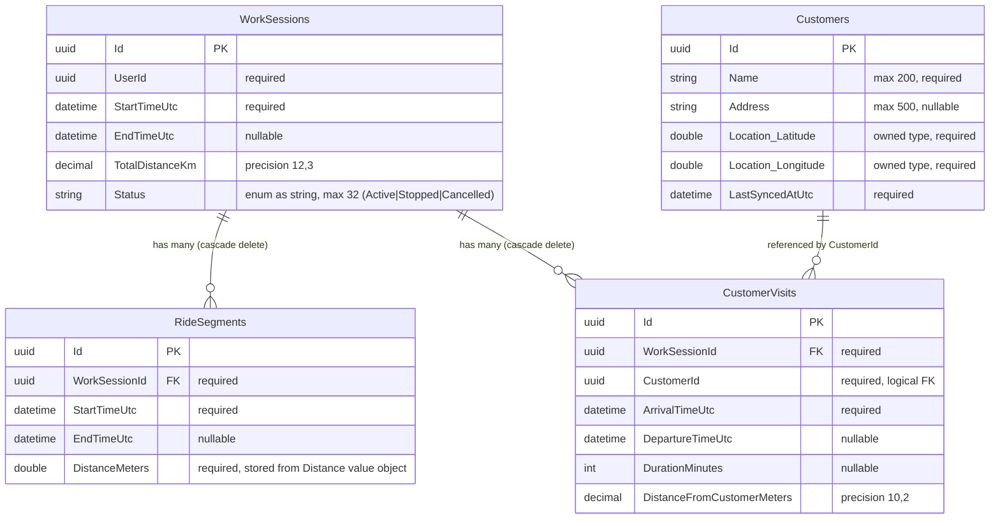

# TimeOn Database ERD

Entity-relationship diagram gebaseerd op `src/TimeOn.Infrastructure` (EF Core mappings) en de domeinentiteiten in `src/TimeOn.Domain`.

## Overzicht

Het project kent **twee databases**:


| Context                | Provider   | Doel                                                      |
| ---------------------- | ---------- | --------------------------------------------------------- |
| `AppDbContext`         | SQL Server | API-database met samengevatte, syncbare data              |
| `LocalDeviceDbContext` | SQLite     | Offline opslag op het apparaat, inclusief GPS-checkpoints |


Checkpoints worden **nooit** in de API-database opgeslagen (`AppDbContext` negeert `RideSegment.Checkpoints`).

---

## API-database (`AppDbContext`)




---

## Lokale database (`LocalDeviceDbContext`)

Bevat dezelfde tabellen als de API-database, plus **Checkpoints** als owned collection op `RideSegments`.

```mermaid
erDiagram
    WorkSessions ||--o{ RideSegments : "has many (cascade delete)"
    WorkSessions ||--o{ CustomerVisits : "has many (cascade delete)"
    Customers ||--o{ CustomerVisits : "referenced by CustomerId"
    RideSegments ||--o{ Checkpoints : "owns many (local only)"

    WorkSessions {
        uuid Id PK
        uuid UserId
        datetime StartTimeUtc
        datetime EndTimeUtc
        decimal TotalDistanceKm
        string Status
    }

    RideSegments {
        uuid Id PK
        uuid WorkSessionId FK
        datetime StartTimeUtc
        datetime EndTimeUtc
        double DistanceMeters
    }

    Checkpoints {
        uuid RideSegmentId PK_FK "composite key"
        datetime RecordedAtUtc PK "composite key"
        double Location_Latitude "owned type"
        double Location_Longitude "owned type"
    }

    CustomerVisits {
        uuid Id PK
        uuid WorkSessionId FK
        uuid CustomerId
        datetime ArrivalTimeUtc
        datetime DepartureTimeUtc
        int DurationMinutes
        decimal DistanceFromCustomerMeters
    }

    Customers {
        uuid Id PK
        string Name
        string Address
        double Location_Latitude
        double Location_Longitude
        datetime LastSyncedAtUtc
    }
```


---

## Relaties en constraints


| Van                            | Naar              | Type        | Delete rule | Opmerking                                                                 |
| ------------------------------ | ----------------- | ----------- | ----------- | ------------------------------------------------------------------------- |
| `RideSegments.WorkSessionId`   | `WorkSessions.Id` | 1:N         | Cascade     | Geconfigureerd in `WorkSessionConfiguration`                              |
| `CustomerVisits.WorkSessionId` | `WorkSessions.Id` | 1:N         | Cascade     | Geconfigureerd in `WorkSessionConfiguration`                              |
| `CustomerVisits.CustomerId`    | `Customers.Id`    | N:1         | —           | Logische relatie; geen expliciete EF `HasOne`/`HasForeignKey`             |
| `Checkpoints.RideSegmentId`    | `RideSegments.Id` | 1:N (owned) | Cascade     | Alleen in `LocalDeviceDbContext` via `RideSegmentCheckpointConfiguration` |


---

## Domein vs. database


| Concept         | Domein                          | API DB                                               | Local DB         |
| --------------- | ------------------------------- | ---------------------------------------------------- | ---------------- |
| `WorkSession`   | Aggregate root                  | `WorkSessions`                                       | `WorkSessions`   |
| `RideSegment`   | Entity                          | `RideSegments`                                       | `RideSegments`   |
| `Checkpoint`    | Value object (`ILocalOnlyData`) | Niet opgeslagen                                      | `Checkpoints`    |
| `CustomerVisit` | Entity                          | `CustomerVisits`                                     | `CustomerVisits` |
| `Customer`      | Aggregate root                  | `Customers`                                          | `Customers`      |
| `Coordinate`    | Value object                    | Owned columns op `Customers` (en checkpoints lokaal) | Idem             |
| `Distance`      | Value object                    | Opgeslagen als `DistanceMeters` (double)             | Idem             |


---

## Bronbestanden

- `src/TimeOn.Infrastructure/Persistence/AppDbContext.cs`
- `src/TimeOn.Infrastructure/Persistence/Configurations/WorkSessionConfiguration.cs`
- `src/TimeOn.Infrastructure/Persistence/Configurations/RideSegmentConfiguration.cs`
- `src/TimeOn.Infrastructure/Persistence/Configurations/CustomerVisitConfiguration.cs`
- `src/TimeOn.Infrastructure/Persistence/Configurations/CustomerConfiguration.cs`
- `src/TimeOn.Infrastructure/Persistence/Configurations/RideSegmentCheckpointConfiguration.cs`
- `src/TimeOn.Domain/Entities/*.cs`

