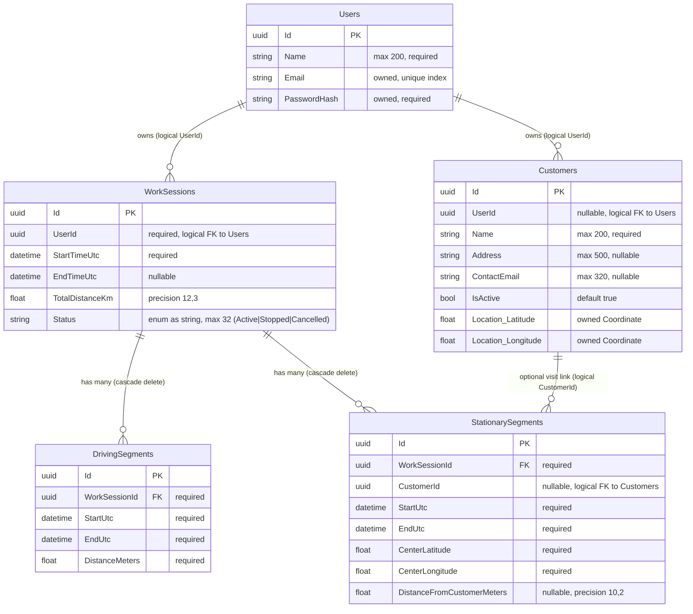
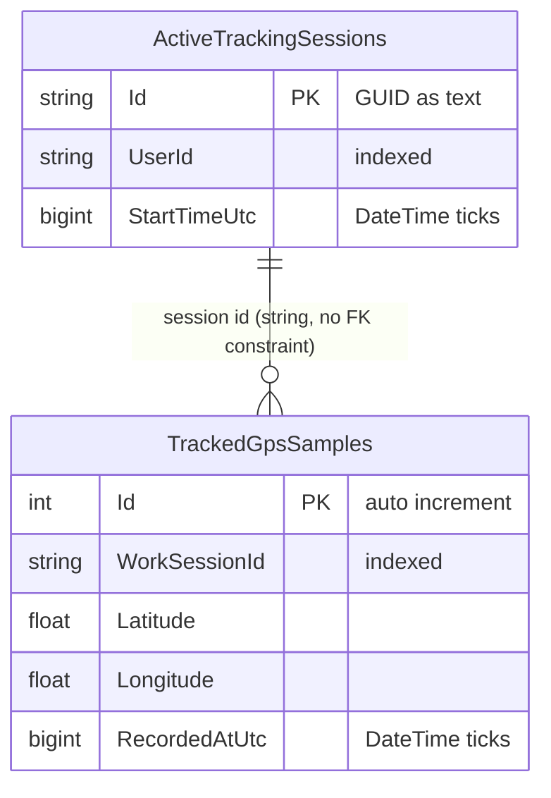
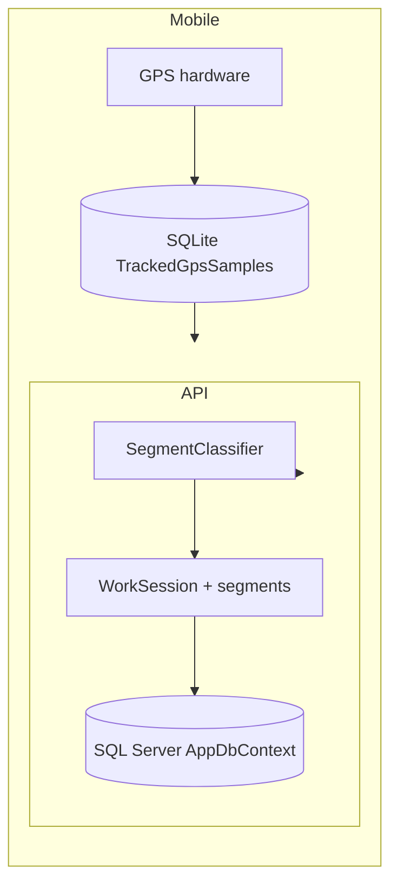

# TimeOn Database ERD

Entity-relationship diagram gebaseerd op `src/TimeOn.Infrastructure` (EF Core) en de domeinentiteiten in `src/TimeOn.Domain`.

## Overzicht

De oplossing gebruikt **twee opslaglagen**:

| Opslag                | Provider   | Locatie                           | Doel                                                                                |
| --------------------- | ---------- | --------------------------------- | ----------------------------------------------------------------------------------- |
| `AppDbContext`        | SQL Server | API (`TimeOn.Api`)                | Brondata: gebruikers, klanten, afgeronde werksessies met geclassificeerde segmenten |
| `SqliteTrackingStore` | SQLite     | Mobile (`timeon-tracking-v2.db3`) | Offline ruwe GPS-metingen en actieve sessiestatus tijdens tracking                  |

Ruwe GPS-punten (`GpsPoint`) worden **niet** opgeslagen in SQL Server. Ze worden op het apparaat verzameld, bij afronden naar de API gestuurd, server-side geclassificeerd en alleen bewaard als samenvattingen in `DrivingSegment` / `StationarySegment`.

## API-database (`AppDbContext`)

---

## Mobile tracking-database (SQLite)

Beheerd door `SqliteTrackingStore` — geen EF Core.

---

## Relaties en constraints

| Van                                | Naar                        | Type | Verwijderregel | Opmerking                                                    |
| ---------------------------------- | --------------------------- | ---- | -------------- | ------------------------------------------------------------ |
| `DrivingSegments.WorkSessionId`    | `WorkSessions.Id`           | 1:N  | Cascade        | `WorkSessionConfiguration`                                   |
| `StationarySegments.WorkSessionId` | `WorkSessions.Id`           | 1:N  | Cascade        | `WorkSessionConfiguration`                                   |
| `WorkSessions.UserId`              | `Users.Id`                  | N:1  | —              | Alleen logisch; geen EF `HasForeignKey`                      |
| `StationarySegments.CustomerId`    | `Customers.Id`              | N:1  | —              | Alleen logisch; bezoek = stilstaand segment met `CustomerId` |
| `Customers.UserId`                 | `Users.Id`                  | N:1  | —              | Alleen logisch                                               |
| `TrackedGpsSamples.WorkSessionId`  | `ActiveTrackingSessions.Id` | N:1  | —              | Alleen koppeling op applicatieniveau                         |

---

## Domein vs. database

| Concept            | Domeintype          | API-tabel                        | Mobile SQLite                             |
| ------------------ | ------------------- | -------------------------------- | ----------------------------------------- |
| Werkdag / rit      | `WorkSession`       | `WorkSessions`                   | `ActiveTrackingSessions` (tijdens actief) |
| Rijperiode         | `DrivingSegment`    | `DrivingSegments`                | —                                         |
| Stop / klantbezoek | `StationarySegment` | `StationarySegments`             | —                                         |
| Ruwe GPS-meting    | `GpsPoint`          | —                                | `TrackedGpsSamples`                       |
| Klant              | `Customer`          | `Customers`                      | —                                         |
| Gebruikersaccount  | `User`              | `Users`                          | JWT + `SecureStorage` (niet in SQLite)    |
| Locatie            | `Coordinate`        | Owned-kolommen op `Customers`    | Lat/long-kolommen op samples              |
| Afstand            | `Distance`          | `DistanceMeters` op rijsegmenten | —                                         |

### Datastroom (tracking → opslag)

---

## Bronbestanden

- `src/TimeOn.Infrastructure/Persistence/AppDbContext.cs`
- `src/TimeOn.Infrastructure/Persistence/TimeOnDbContextBase.cs`
- `src/TimeOn.Infrastructure/Persistence/Configurations/WorkSessionConfiguration.cs`
- `src/TimeOn.Infrastructure/Persistence/Configurations/DrivingSegmentConfiguration.cs`
- `src/TimeOn.Infrastructure/Persistence/Configurations/StationarySegmentConfiguration.cs`
- `src/TimeOn.Infrastructure/Persistence/Configurations/CustomerConfiguration.cs`
- `src/TimeOn.Infrastructure/Persistence/Configurations/UserConfiguration.cs`
- `src/TimeOn.Infrastructure/Migrations/AppDbContextModelSnapshot.cs`
- `src/TimeOn.Mobile/Features/Tracking/Services/SqliteTrackingStore.cs`
- `src/TimeOn.Domain/Entities/*.cs`

