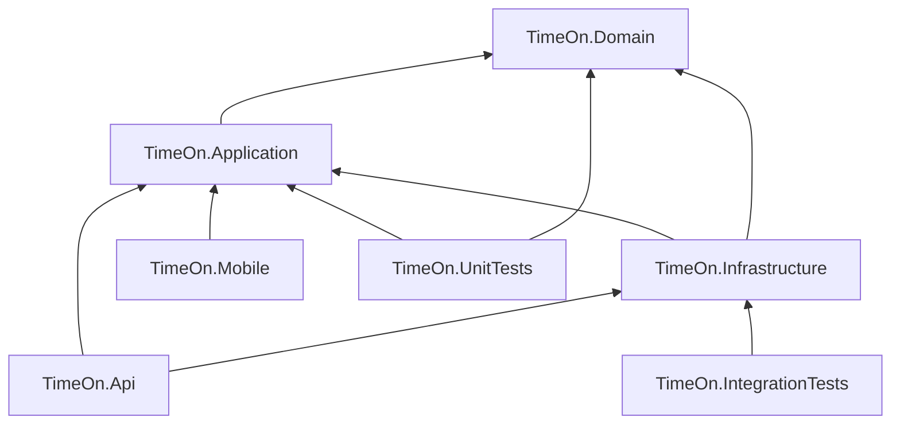

# TimeOn — Clean Architecture Validation Report

**Date:** 2026-05-28  
**Stack:** .NET 10, ASP.NET Core API, .NET MAUI, EF Core, FluentValidation, Result pattern (no MediatR)

---

## 1. Executive summary

The solution follows a **pragmatic Clean Architecture** suitable for a school project. Critical violations were fixed:

| Area | Status |
|------|--------|
| Project layering (Domain → Application → Infrastructure → Api) | ✅ Correct |
| MAUI must not reference Infrastructure | ✅ **Fixed** |
| Result pattern single source (Domain) | ✅ **Fixed** |
| Domain free of external packages | ✅ **Fixed** (removed GoogleMaps from Domain) |
| API dev networking (5000/5001, CORS, Swagger) | ✅ **Fixed** |
| Android emulator API URL (`10.0.2.2`) | ✅ **Fixed** |
| MediatR / CQRS | ✅ Not used (appropriate) |
| Build (Api, Application, Domain, Infrastructure, MAUI Windows) | ✅ Succeeds |
| Unit tests | ⚠️ 19/20 pass (1 pre-existing Auth test mismatch) |

---

## 2. Dependency graph



**Allowed dependency direction:** outer layers depend inward. MAUI talks to the API over HTTP only.

---

## 3. Violations found & status

| # | Violation | Severity | Status |
|---|-----------|----------|--------|
| 1 | `TimeOn.Mobile` referenced `TimeOn.Infrastructure` (EF, repos, JWT on client) | **Critical** | ✅ Fixed — removed reference |
| 2 | `AddMobileInfrastructure()` duplicated server persistence on client | **Critical** | ✅ Removed |
| 3 | Duplicate `Result` in Application and Domain | Medium | ✅ Fixed — Application uses `Domain.Shared.Result` |
| 4 | `GoogleMaps.LocationServices` in Domain (unused) | Medium | ✅ Removed |
| 5 | API ports 59008/59009, no CORS/Swagger | Medium | ✅ Fixed → 5000/5001 + CORS + Swagger |
| 6 | Android used `127.0.0.1` + adb reverse instead of `10.0.2.2` | Medium | ✅ Fixed |
| 7 | Value objects in `Objects/` folder but `ValueObjects` namespace | Low | 📋 Document only |
| 8 | Domain events present but unused in app flow | Low | 📋 Optional simplification |
| 9 | `ILocalWorkSessionRepository` + dual repos | Low | 📋 Optional simplification |
| 10 | Infrastructure references Domain directly | Low | ✅ Acceptable for EF mappings |
| 11 | Auth unit test expects exception; service returns `Result` | Low | ⚠️ Pre-existing |

---

## 4. Auto-applied fixes

1. Removed `ProjectReference` to Infrastructure from `TimeOn.Mobile.csproj`
2. Removed `AddApplication()` / `AddMobileInfrastructure()` from MAUI DI
3. Replaced EF-based sync with `ICacheStore` in `SyncService`
4. Removed DB initializer startup from `MauiProgram`
5. Standardized API URLs: `http://0.0.0.0:5000`, `https://0.0.0.0:5001`
6. Added Swagger, development CORS, EF `MigrateAsync()` on API startup
7. Android `appsettings.android.json` → `http://10.0.2.2:5000/`
8. Consolidated Result pattern to `TimeOn.Domain.Shared`
9. Removed unused `GoogleMaps` package from Domain
10. Removed `AddMobileInfrastructure` from Infrastructure DI

---

## 5. Simplified recommendations (school project)

**Keep**

- Feature folders in Application (`Features/Auth`, `Features/Customers`, …)
- Application services (not MediatR handlers)
- FluentValidation + `ValidationBehavior`
- `Result<T>` from Domain
- Thin API controllers
- Typed `HttpClient` (`IApiService`) in MAUI

**Consider removing later (not blocking)**

- Unused domain events (`WorkSessionStartedEvent`, etc.) if you never dispatch them
- `ILocalWorkSessionRepository` if local SQL Server path is never used from API
- `LocalCustomerRepository` / `LocalDbContext` in Infrastructure if API only uses SQL Server
- Separate `TripService` / `LocationService` until those screens call the API

**Do not add**

- MediatR pipelines, generic repositories, separate Contracts project unless the course requires it

---

## 6. Emulator / API networking checklist

### Start API

```bash
dotnet run --project src/TimeOn.Api
```

- HTTP: `http://localhost:5000` (host) / `http://10.0.2.2:5000` (emulator)
- HTTPS: `https://localhost:5001`
- Swagger: `https://localhost:5001/swagger`

### Why `10.0.2.2`?

Inside the Android emulator, `localhost` is the **emulator itself**, not your PC. `10.0.2.2` is the special alias to the **host machine** where Kestrel runs.

### Windows MAUI

`appsettings.json` → `https://localhost:5001/`

### Android cleartext HTTP

Already configured:

- `AndroidManifest.xml`: `usesCleartextTraffic="true"`
- `network_security_config.xml`: cleartext permitted for development

### CORS (development)

Allows origins containing `localhost`, `127.0.0.1`, or `10.0.2.2`.

### Physical Android device

Set PC LAN IP in `appsettings.android.json`, e.g. `http://192.168.1.10:5000/`.

---

## 7. Project structure tree

```
MauiProject/
├── TimeOn.slnx
├── docs/
│   ├── ARCHITECTURE_VALIDATION.md
│   └── rules.md
├── src/
│   ├── TimeOn.Domain/
│   │   ├── Entities/
│   │   ├── Objects/          (value objects — namespace: ValueObjects)
│   │   ├── Enums/
│   │   ├── Shared/           (Result, Entity, AggregateRoot)
│   │   ├── Exceptions/
│   │   ├── RepositoryInterfaces/
│   │   ├── Interfaces/
│   │   ├── Services/
│   │   ├── Events/           (optional DDD-lite)
│   │   └── Constants/
│   ├── TimeOn.Application/
│   │   ├── Features/         (Auth, Customers, Trips, Locations)
│   │   ├── Interfaces/
│   │   ├── Behaviors/
│   │   └── DependencyInjection/
│   ├── TimeOn.Infrastructure/
│   │   ├── Persistence/
│   │   ├── Repositories/
│   │   ├── Authentication/
│   │   ├── External/
│   │   ├── Configurations/
│   │   ├── Migrations/
│   │   └── DependencyInjection/
│   ├── TimeOn.Api/
│   │   ├── Controllers/
│   │   └── Program.cs
│   └── TimeOn.Mobile/
│       ├── Features/         (Views + ViewModels)
│       ├── Services/         (ApiService, RemoteCustomerService, …)
│       ├── Caching/
│       ├── Sync/
│       ├── Interfaces/
│       ├── Extensions/
│       └── Platforms/
└── tests/
    ├── TimeOn.UnitTests/
    └── TimeOn.IntegrationTests/
```

---

## 8. Layer compliance (post-fix)

| Layer | Rules | Compliance |
|-------|-------|------------|
| **Domain** | No EF/HTTP/MAUI | ✅ |
| **Application** | Only Domain; use cases + DTOs | ✅ |
| **Infrastructure** | EF, repos, JWT, Google geocoding | ✅ |
| **Api** | Controllers orchestrate services | ✅ |
| **Mobile** | HTTP only; no Infrastructure | ✅ |

---

## 9. EF Core migrations

Migrations live in `TimeOn.Infrastructure/Migrations/`. On development startup, the API runs:

```csharp
await dbContext.Database.MigrateAsync();
```

Manual command:

```bash
dotnet ef migrations add <Name> --project src/TimeOn.Infrastructure --startup-project src/TimeOn.Api
dotnet ef database update --project src/TimeOn.Infrastructure --startup-project src/TimeOn.Api
```
