# .NET MAUI Ontwerpdocument – Time On

**Auteur:** Luuk de Vos

---

## Versies

| Versie | Status | Datum | Omschrijving |
|--------|--------|-------|--------------|
| 1.0 | Concept | 23/04/2026 | Eerste versie document |
| 1.1 | In uitvoering | 06/06/2026 | Uitbreiding op basis van huidige codebase en architectuurdocumenten |

---

## Inhoudsopgave

1. [Functioneel ontwerp](#1-functioneel-ontwerp)
   - [1.1 Functionele beschrijving](#11-functionele-beschrijving)
   - [1.2 WireFrames](#12-wireframes)
   - [1.3 Overzicht web api](#13-overzicht-web-api)
   - [1.4 Usecase diagram](#14-usecase-diagram)
   - [1.5 UserStories](#15-userstories)
   - [1.6 Huisstijl](#16-huisstijl)
2. [Technisch ontwerp](#2-technisch-ontwerp)
   - [2.1 ERD](#21-erd)
   - [2.2 Security](#22-security)
   - [2.3 Architectuur & design patterns](#23-architectuur--design-patterns)
   - [2.4 Class & Package diagram](#24-class--package-diagram)
   - [2.5 Sequence diagram](#25-sequence-diagram)
   - [2.7 Device features & sensoren](#27-device-features--sensoren)
3. [Testresultaten](#3-testresultaten)
   - [3.1 Unittests API](#31-unittests-api)
   - [3.2 Unittests MAUI](#32-unittests-maui)
   - [3.3 Integratietest](#33-integratietest)

---

## 1. Functioneel ontwerp

### 1.1 Functionele beschrijving

Time On is een .NET MAUI-app voor automatische kilometerregistratie en klantbezoek-tracking gedurende de werkdag. De app is bedoeld voor gebruikers van Time On die veel onderweg zijn naar klanten, zoals consultants, monteurs en accountmanagers.

#### Doel

Het doel van de app is het automatisch registreren van gereden kilometers en bezochte locaties. De app detecteert rijbewegingen en stops via GPS, slaat locaties lokaal op tijdens tracking en dient de gegevens bij afronding in bij de Web API. De server classificeert ruwe GPS-punten in rij- en stilstaande segmenten, waarna de gebruiker een overzicht krijgt van werkdagen, kilometers en stops.

#### Geïmplementeerde modules

| Module | Beschrijving |
|--------|--------------|
| **Authenticatie** | Login en registratie met JWT-sessie; automatische token-vernieuwing |
| **GPS-tracking** | Start/stop werkdag, lokale SQLite-buffering, indienen bij API bij stop |
| **Rittenoverzicht** | Lijst van werksessies met detailweergave van rij- en stilstaande segmenten |
| **Klantenbeheer** | CRUD-operaties, lijstweergave en kaartweergave (native op Android, WebView op Windows) |
| **Dashboard** | Welkomstscherm na inloggen |
| **Instellingen** | Uitloggen en development-modus (Windows) |

#### Navigatiestructuur

De app gebruikt een `Shell` met login-gating. Na succesvolle authenticatie navigeert de gebruiker naar een tabbladenstructuur.

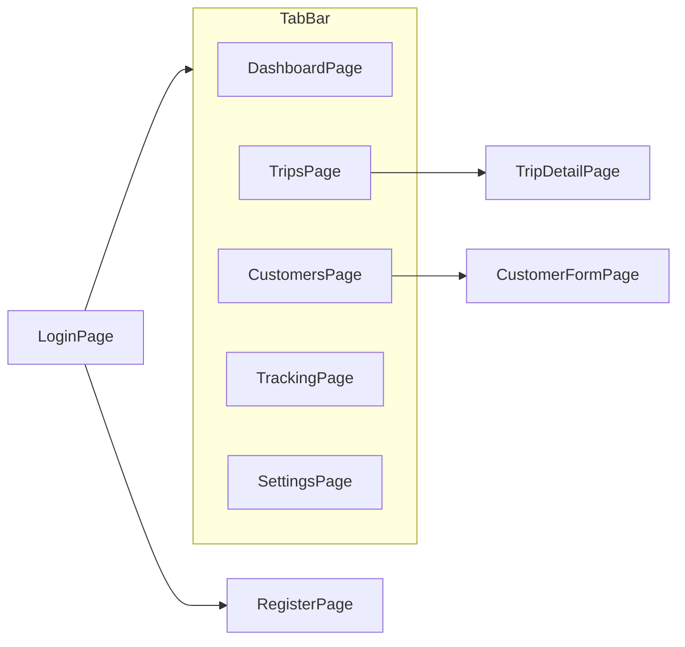

**Solution-structuur:** de app maakt deel uit van een Clean Architecture-oplossing met vijf projecten: `TimeOn.Domain`, `TimeOn.Application`, `TimeOn.Infrastructure`, `TimeOn.Api` en `TimeOn.Mobile`. De mobile app communiceert via HTTP + JWT met de Web API; businesslogica voor GPS-classificatie draait server-side.

---

### 1.2 WireFrames

Onderstaand overzicht beschrijft alle schermen in de app. Per scherm is ruimte gereserveerd voor een screenshot die later kan worden toegevoegd.

#### Schermoverzicht

| Scherm | Route | Beschrijving |
|--------|-------|--------------|
| Login | `LoginPage` | E-mail/wachtwoord, link naar registratie |
| Register | `RegisterPage` | Account aanmaken |
| Dashboard | `DashboardPage` | Welkomsttekst |
| Tracking | `TrackingPage` | Start/stop tracking, sessiestatus |
| Trips | `TripsPage` | Lijst werksessies (datum, km) |
| Trip detail | `TripDetailPage` | Segmenten (rijden/stilstand) |
| Customers | `CustomersPage` | Lijst/kaart toggle |
| Customer form | `CustomerFormPage` | Klant aanmaken of bewerken |
| Settings | `SettingsPage` | Logout, development mode |

#### LoginPage

<!-- Screenshot: LoginPage -->

Verticale layout met invoervelden voor e-mail en wachtwoord, een foutmelding (rood), knoppen "Sign in" en "Sign up", en een activity indicator tijdens het laden. Binding naar `LoginViewModel`.

#### RegisterPage

<!-- Screenshot: RegisterPage -->

Verticale layout met invoervelden voor naam, e-mail en wachtwoord, foutmelding, knoppen "Sign up" en "Log in", en activity indicator. Binding naar `RegisterViewModel`.

#### DashboardPage

<!-- Screenshot: DashboardPage -->

Eenvoudig welkomstscherm met een grote label die de welkomstboodschap toont (`WelcomeMessage` uit `DashboardViewModel`).

#### TrackingPage

<!-- Screenshot: TrackingPage -->

Kernscherm voor kilometerregistratie. Toont "Tracker Modus", statuslabel, foutmelding, Start- en Stop-knoppen. In development-modus (Windows) verschijnt een extra sectie om GPS JSON te plakken en een werksessie handmatig op te slaan.

#### TripsPage

<!-- Screenshot: TripsPage -->

Lijst van werksessies in een `CollectionView` met pull-to-refresh. Elke kaart toont starttijd, eindtijd, status en totale afstand. Tik op een kaart opent het detail. Lege staat: "No trips yet."

#### TripDetailPage

<!-- Screenshot: TripDetailPage -->

Detailweergave met terug-knop, delete-knop, sessie-metadata (start, eind, status, totale km) en een lijst van segmenten. Segmenten tonen type (rijden/stilstand), duur en afstand of locatiecoördinaten.

#### CustomersPage

<!-- Screenshot: CustomersPage -->

Schakelt tussen lijst- en kaartweergave via "List" / "Map"-knoppen. "Create" opent het formulier. In lijstmodus: selecteerbare klantkaarten met naam, e-mail, adres en actief-status. In kaartmodus: native map (Android) of WebView-map (Windows) met markers.

#### CustomerFormPage

<!-- Screenshot: CustomerFormPage -->

Formulier voor aanmaken of bewerken van een klant: naam, contact-e-mail, adres, actief-switch, Save- en Cancel-knoppen.

#### SettingsPage

<!-- Screenshot: SettingsPage -->

Development-modus toggle (Windows) en Logout-knop. Development-modus schakelt extra GPS-tools in op het Tracking-scherm.

---

### 1.3 Overzicht web api

De mobile app communiceert met een eigen ASP.NET Web API (`TimeOn.Api`). De API gebruikt Entity Framework Core met SQL Server, FluentValidation voor invoervalidatie en JWT Bearer-authenticatie.

#### Endpoints

| Controller | Methode | Route | Auth | Beschrijving |
|------------|---------|-------|------|--------------|
| Auth | GET | `/api/auth` | Nee | Health check |
| Auth | POST | `/api/auth/login` | Nee | Inloggen; retourneert JWT access + refresh token |
| Auth | POST | `/api/auth/register` | Nee | Registreren; retourneert tokens |
| Auth | POST | `/api/auth/refresh` | Nee | Access token vernieuwen via refresh token |
| Customers | GET | `/api/customers` | Ja | Alle klanten van ingelogde gebruiker |
| Customers | POST | `/api/customers` | Ja | Klant aanmaken (inclusief geocoding adres → coördinaten) |
| Customers | PUT | `/api/customers/{id}` | Ja | Klant bijwerken |
| Customers | DELETE | `/api/customers/{id}` | Ja | Klant verwijderen |
| WorkSessions | POST | `/api/worksessions/complete` | Ja | GPS-punten indienen; server classificeert en slaat segmenten op |
| WorkSessions | GET | `/api/worksessions` | Ja | Lijst werksessies (afstand, status, tijden) |
| WorkSessions | GET | `/api/worksessions/{id}` | Ja | Detail met rij- en stilstaande segmenten |
| WorkSessions | DELETE | `/api/worksessions/{id}` | Ja | Werksessie verwijderen |
| Users | GET | `/api/users/{id}` | Ja | Gebruiker ophalen |

#### Technische stack API

- **Framework:** ASP.NET Core Web API (.NET 10)
- **Database:** Microsoft SQL Server via EF Core (`AppDbContext`)
- **Authenticatie:** JWT access tokens + refresh tokens (`JwtTokenService`)
- **Validatie:** FluentValidation (login, register, klant-aanvragen)
- **Externe services:** Google Geocoding voor adres → coördinaten bij klantaanmaak

---

### 1.4 Usecase diagram

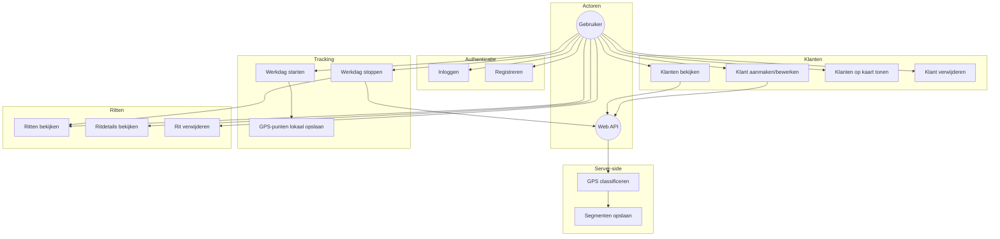

---

### 1.5 UserStories

Onderstaande user stories komen uit het projectvoorstel. Per story zijn acceptatiecriteria en de implementatie in de codebase opgenomen.

#### US-1: Inloggen

> Als gebruiker wil ik kunnen inloggen zodat mijn gegevens veilig opgeslagen worden.

**Acceptatiecriteria:**
- Gebruiker kan inloggen met e-mail en wachtwoord
- Bij succesvolle login wordt doorgestuurd naar het hoofdscherm (TabBar)
- Bij ongeldige credentials verschijnt een foutmelding
- JWT access- en refresh tokens worden opgeslagen voor vervolgrequests

**Implementatie:** `LoginViewModel`, `AuthenticationService`, `POST /api/auth/login`, `AuthTokenStore`, `AppShell` auth-gating

---

#### US-2: Werkdag starten

> Als gebruiker wil ik mijn werkdag kunnen starten zodat mijn ritten automatisch worden bijgehouden.

**Acceptatiecriteria:**
- Gebruiker kan tracking starten via de Tracking-pagina
- Er wordt een unieke werksessie-ID aangemaakt
- GPS-permissies worden opgevraagd voordat tracking begint
- Sessiestatus wordt visueel getoond

**Implementatie:** `GpsTrackingService.StartAsync`, `TrackingViewModel`, `SqliteTrackingStore` (actieve sessie), `IPlatformLocationTracker`

---

#### US-3: Rijden detecteren

> Als gebruiker wil ik dat de app automatisch detecteert wanneer ik aan het rijden ben zodat kilometers geregistreerd worden.

**Acceptatiecriteria:**
- GPS-punten worden periodiek verzameld tijdens tracking
- Punten worden gefilterd op nauwkeurigheid en interval (`GpsSampleEvaluator`)
- Bij afronding classificeert de server punten als rijsegmenten
- Rijsegmenten bevatten berekende afstand in meters/kilometers

**Implementatie:** `GpsSampleEvaluator` (client), `GpsClassifier` (server), `DrivingSegment`, `WorkSessionCompletionService`

---

#### US-4: Stilstand detecteren

> Als gebruiker wil ik dat de app stopt met kilometerregistratie wanneer ik stilsta zodat alleen relevante kilometers worden opgeslagen.

**Acceptatiecriteria:**
- Stilstand wordt gedetecteerd wanneer punten binnen een radius blijven gedurende minimaal 2 minuten
- Stilstaande perioden worden als aparte segmenten opgeslagen
- Rij-kilometers worden niet opgeteld tijdens stilstand

**Implementatie:** `GpsClassifier` met `TrackingConstants.MinimumStopDurationMinutes` (2 min) en `MaxStationaryDistanceMeters` (150 m), `StationarySegment`

---

#### US-5: Locatie opslaan bij stilstand

> Als gebruiker wil ik dat een locatie wordt opgeslagen wanneer ik langer dan x minuten stilsta zodat klantbezoeken automatisch geregistreerd worden.

**Acceptatiecriteria:**
- Elk stilstaand segment bevat center-coördinaten (latitude/longitude)
- Segmenten hebben start- en eindtijd
- Stops korter dan de drempel worden niet als stilstaand segment opgeslagen

**Implementatie:** `StationarySegment` met `CenterLatitude`, `CenterLongitude`, `StartUtc`, `EndUtc`

---

#### US-6: Kilometeroverzicht per dag

> Als gebruiker wil ik een overzicht van mijn gereden kilometers per dag zodat ik mijn rittenadministratie kan bijhouden.

**Acceptatiecriteria:**
- Lijst toont werksessies gesorteerd op datum (nieuwste eerst)
- Per sessie: starttijd, eindtijd, status en totale kilometers
- Pull-to-refresh werkt om de lijst te verversen

**Implementatie:** `TripsViewModel`, `RemoteWorkSessionService`, `GET /api/worksessions`

---

#### US-7: Bezochte klantlocaties

> Als gebruiker wil ik een lijst zien van bezochte klantlocaties zodat ik mijn werkdag kan analyseren.

**Acceptatiecriteria:**
- Ritdetail toont alle segmenten van een werksessie
- Stilstaande segmenten tonen locatiecoördinaten
- Rijsegmenten tonen afgelegde afstand

**Implementatie:** `TripDetailPage`, `TripDetailViewModel`, `WorkSessionDetailDto` met `WorkSessionSegmentDto`

---

#### US-8: Klantsuggesties

> Als gebruiker wil ik automatische klantsuggesties krijgen op basis van mijn locatie zodat ik snel een klant kan koppelen aan een bezoek.

**Acceptatiecriteria:**
- Stilstaande segmenten kunnen gekoppeld worden aan een klant via `CustomerId`
- Domeinmodel ondersteunt afstand tot klant (`DistanceFromCustomerMeters`)
- Proximity-radius is gedefinieerd (`CustomerProximityRadiusMeters`: 500 m)

**Implementatie:** `StationarySegment.CustomerId`, `TrackingConstants.CustomerProximityRadiusMeters`, klantcoördinaten via `Customer.Location`

---

#### US-9: Meldingen bij rijden

> Als gebruiker wil ik meldingen ontvangen wanneer ik weer begin met rijden zodat ik weet dat de kilometerregistratie actief is.

**Acceptatiecriteria:**
- Tijdens tracking op Android verschijnt een persistente foreground-notificatie
- Notificatie geeft aan dat locatie-tracking actief is

**Implementatie:** Android `LocationForegroundService`, `INotificationService`

---

#### US-10: Ritten corrigeren

> Als gebruiker wil ik mijn ritten kunnen corrigeren of aanpassen zodat fouten hersteld kunnen worden.

**Acceptatiecriteria:**
- Gebruiker kan een werksessie verwijderen vanuit het detail-scherm
- Na verwijderen verdwijnt de sessie uit het overzicht

**Implementatie:** `TripDetailViewModel.DeleteCommand`, `RemoteWorkSessionService.DeleteAsync`, `DELETE /api/worksessions/{id}`

---

#### US-11: Privacy lokaal

> Als gebruiker wil ik dat mijn data lokaal afgeschermd wordt en alleen de losse ritten / boekingen opgeslagen worden zodat ik mijn privacy behoud.

**Acceptatiecriteria:**
- Ruwe GPS-punten worden alleen lokaal opgeslagen in SQLite tijdens actieve tracking
- Bij stop worden punten naar de API gestuurd en lokaal opgeschoond
- Server slaat geen ruwe GPS-punten op, alleen geclassificeerde segmenten
- API-requests verlopen via geauthenticeerde HTTPS-verbinding

**Implementatie:** `SqliteTrackingStore`, `POST /api/worksessions/complete`, segment-gebaseerde opslag in SQL Server

---

### 1.6 Huisstijl

De app gebruikt de standaard .NET MAUI-template als basis voor kleuren en typografie.

#### Kleuren

Gedefinieerd in `src/TimeOn.Mobile/Resources/Styles/Colors.xaml`:

| Naam | Hex | Gebruik |
|------|-----|---------|
| Primary | `#512BD4` | Hoofdkleur, knoppen |
| PrimaryDark | `#AC99EA` | Donker thema variant |
| Secondary | `#DFD8F7` | Achtergrondaccenten |
| Tertiary | `#2B0B98` | Diepe accentkleur |
| Gray100–Gray950 | `#E1E1E1` – `#141414` | Neutrale tinten |

#### Typografie

Geregistreerd in `MauiProgram.cs`:

| Font | Bestand | Alias |
|------|---------|-------|
| Open Sans Regular | `OpenSans-Regular.ttf` | `OpenSansRegular` |
| Open Sans Semibold | `OpenSans-Semibold.ttf` | `OpenSansSemibold` |

Koppen gebruiken doorgaans `FontSize="24"` met `FontAttributes="Bold"`.

#### Iconen en splash

- App icon: `Resources/AppIcon/appicon.svg` + `appiconfg.svg`
- Splash screen: `Resources/Splash/splash.svg`

#### Thema

De app ondersteunt light/dark mode via `AppThemeBinding` (bijv. op Tracking- en Settings-pagina's).

---

## 2. Technisch ontwerp

### 2.1 ERD

De oplossing gebruikt **twee opslaglagen**: SQL Server op de API voor brondata, en SQLite op het mobile apparaat voor offline GPS-buffering tijdens tracking.

#### API-database (`AppDbContext` — SQL Server)

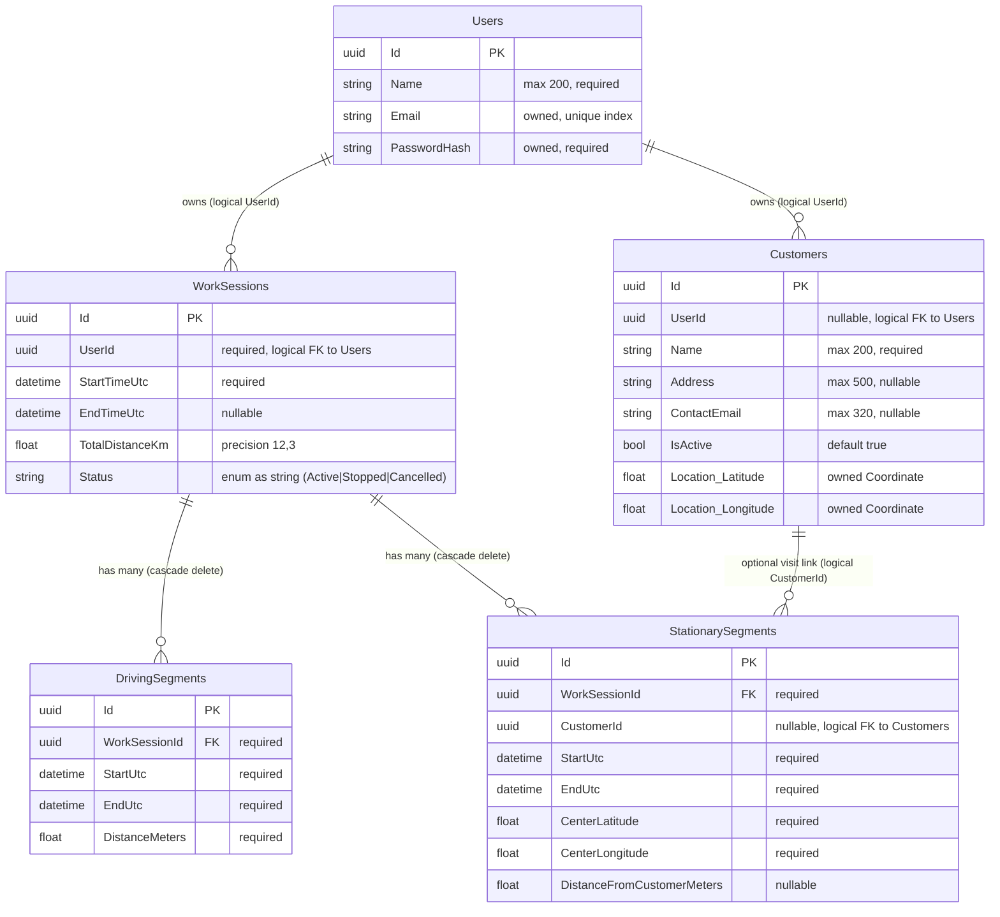

#### Mobile tracking-database (SQLite)

Beheerd door `SqliteTrackingStore` — geen EF Core.

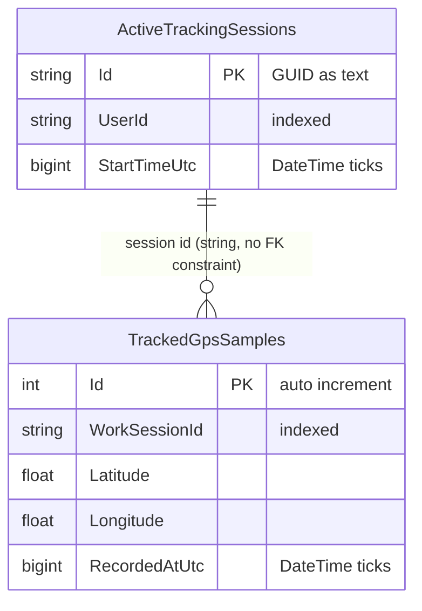

#### Datastroom tracking → opslag

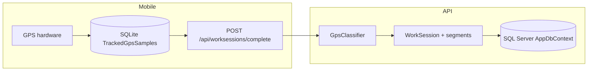

**Kernprincipe:** ruwe GPS-punten (`GpsPoint`) worden niet opgeslagen in SQL Server. Ze worden op het apparaat verzameld, bij afronden naar de API gestuurd, server-side geclassificeerd en alleen bewaard als samenvattingen in `DrivingSegment` / `StationarySegment`.

#### Domein vs. database

| Concept | Domeintype | API-tabel | Mobile SQLite |
|---------|------------|-----------|---------------|
| Werkdag / rit | `WorkSession` | `WorkSessions` | `ActiveTrackingSessions` |
| Rijperiode | `DrivingSegment` | `DrivingSegments` | — |
| Stop / klantbezoek | `StationarySegment` | `StationarySegments` | — |
| Ruwe GPS-meting | `GpsPoint` | — | `TrackedGpsSamples` |
| Klant | `Customer` | `Customers` | — |
| Gebruikersaccount | `User` | `Users` | JWT in Preferences |
| Locatie | `Coordinate` | Owned-kolommen op `Customers` | Lat/long op samples |

---

### 2.2 Security

#### Authenticatie

- **JWT access tokens** met korte levensduur, uitgegeven door `JwtTokenService`
- **Refresh tokens** voor sessie-verlenging zonder opnieuw inloggen
- Mobile: `BearerTokenRefreshingHandler` voegt automatisch `Authorization: Bearer` toe en vernieuwt bij HTTP 401
- API: `[Authorize]`-attribuut op `WorkSessionsController` en beschermde endpoints; `ICurrentUserAccessor` leest user ID uit JWT claims

#### Wachtwoordbeveiliging

- Wachtwoorden worden gehashed met BCrypt via `PasswordHasher` (Infrastructure)
- Plaintext-wachtwoorden worden nooit opgeslagen
- Domein-entiteit `User` valideert credentials via `Authenticate()` en `HashedPassword` value object

#### Tokenopslag (mobile)

- Access- en refresh tokens worden opgeslagen via `AuthTokenStore` → `LocalStorageService` → MAUI `Preferences`
- Tokens worden gewist bij logout (`ClearAsync`)

#### API-beveiliging

- Alle muterende klant- en werksessie-endpoints vereisen authenticatie
- Refresh-endpoint retourneert `401 Unauthorized` bij ongeldige tokens
- Login/register retourneren `400 BadRequest` bij validatiefouten (geen credential-lek via verschillende statuscodes)

#### Privacy

- Ruwe GPS-punten blijven lokaal in SQLite (`timeon-tracking-v2.db3`) tijdens tracking
- Na succesvolle indiening worden lokale punten opgeschoond
- Server slaat alleen geaggregeerde segmenten op, geen ruwe GPS-trail

---

### 2.3 Architectuur & design patterns

#### Solution-lagen

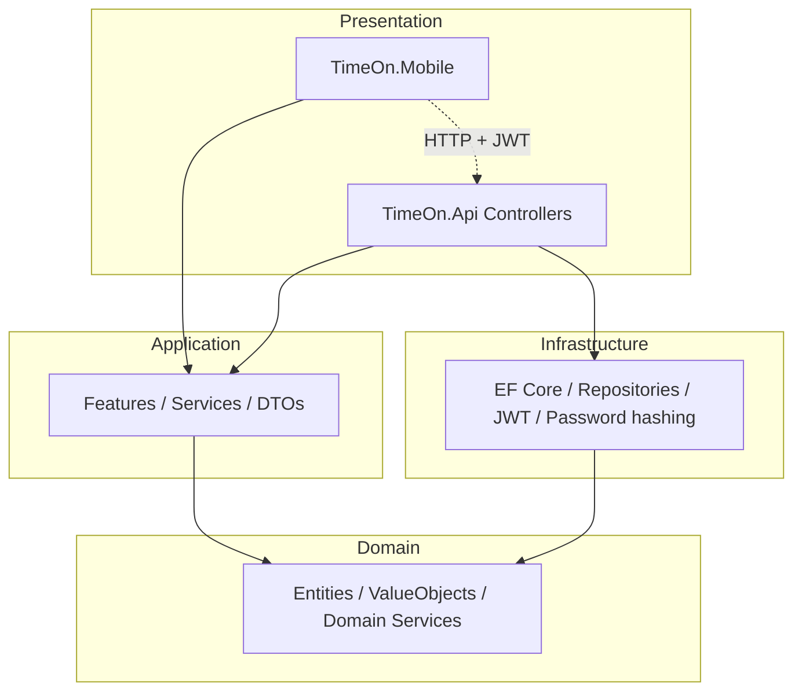

#### Toegepaste design patterns

| Pattern | Toepassing | Onderbouwing |
|---------|------------|--------------|
| **MVVM** | ViewModels in `Features/*/ViewModels/` | Scheiding UI-logica van views; data binding via `CommunityToolkit.Mvvm` (`[ObservableProperty]`, `[RelayCommand]`) |
| **Repository** | `IWorkSessionRepository`, `ICustomerRepository`, `IUserRepository` | Abstractie datalaag; Infrastructure implementeert met EF Core |
| **Service / Adapter** | `RemoteCustomerService`, `RemoteWorkSessionService` | Mobile implementeert Application-interfaces via HTTP; geen directe EF Core-afhankelijkheid op device |
| **Result** | `Result<T>` / `Result` in Domain | Expliciete success/failure zonder exceptions voor business flows |
| **Dependency Injection** | `MauiProgram` → `ServiceCollectionExtensions`; API → `InfrastructureServiceRegistration` | Alle services en ViewModels worden geregistreerd en geïnjecteerd |
| **Domain Service** | `GpsClassifier` | GPS-classificatie is domeinlogica, onafhankelijk van UI en infrastructuur |
| **Platform abstraction** | `IPlatformLocationTracker` | Android foreground service vs. Windows polling tracker achter één interface |
| **Feature-based structure** | `Features/Authentication`, `Tracking`, `Trips`, etc. | Modules zijn gegroepeerd per feature i.p.v. platte UI/ViewModel-mappen |

#### Dependency flow

- `TimeOn.Mobile` → `TimeOn.Application` + `TimeOn.Domain` (geen Infrastructure)
- `TimeOn.Api` → `TimeOn.Application` + `TimeOn.Infrastructure`
- `TimeOn.Domain` heeft geen outward dependencies

---

### 2.4 Class & Package diagram

#### Package-overzicht

| Project | Subfolders | Verantwoordelijkheid |
|---------|------------|---------------------|
| `TimeOn.Domain` | `Entities/`, `Objects/`, `Services/`, `Interfaces/`, `Constants/`, `Enums/`, `Shared/` | Kernentiteiten, value objects, domeinlogica |
| `TimeOn.Application` | `Features/Auth/`, `Features/Customers/`, `Features/WorkSessions/`, `Interfaces/`, `Behaviors/` | Use cases, DTOs, validators, service-interfaces |
| `TimeOn.Infrastructure` | `Persistence/`, `Repositories/`, `Authentication/`, `Configurations/`, `Migrations/`, `External/` | EF Core, JWT, password hashing, Google geocoding |
| `TimeOn.Api` | `Controllers/`, `DependencyInjection/`, `Services/` | HTTP endpoints, JWT middleware, Swagger |
| `TimeOn.Mobile` | `Features/*/`, `Services/`, `Http/`, `Platforms/`, `Extensions/`, `Resources/` | MAUI UI, GPS tracking, API-adapters |

#### Domain — entiteiten en classifier

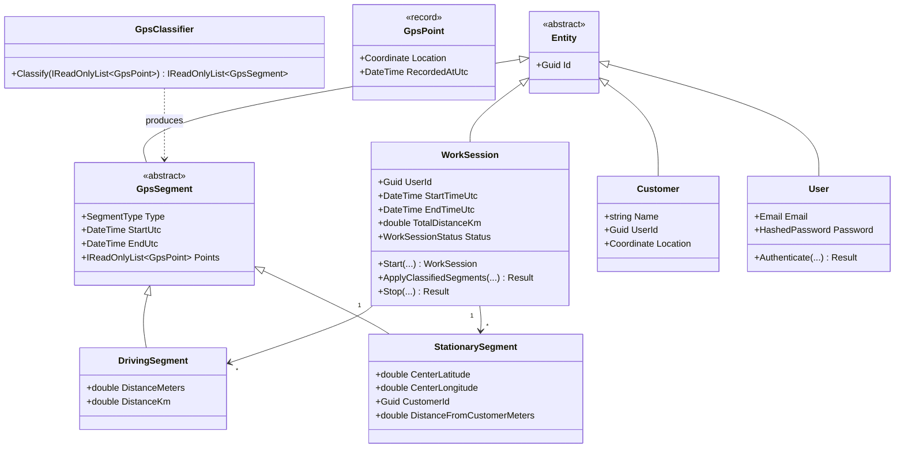

#### Application — WorkSession flow

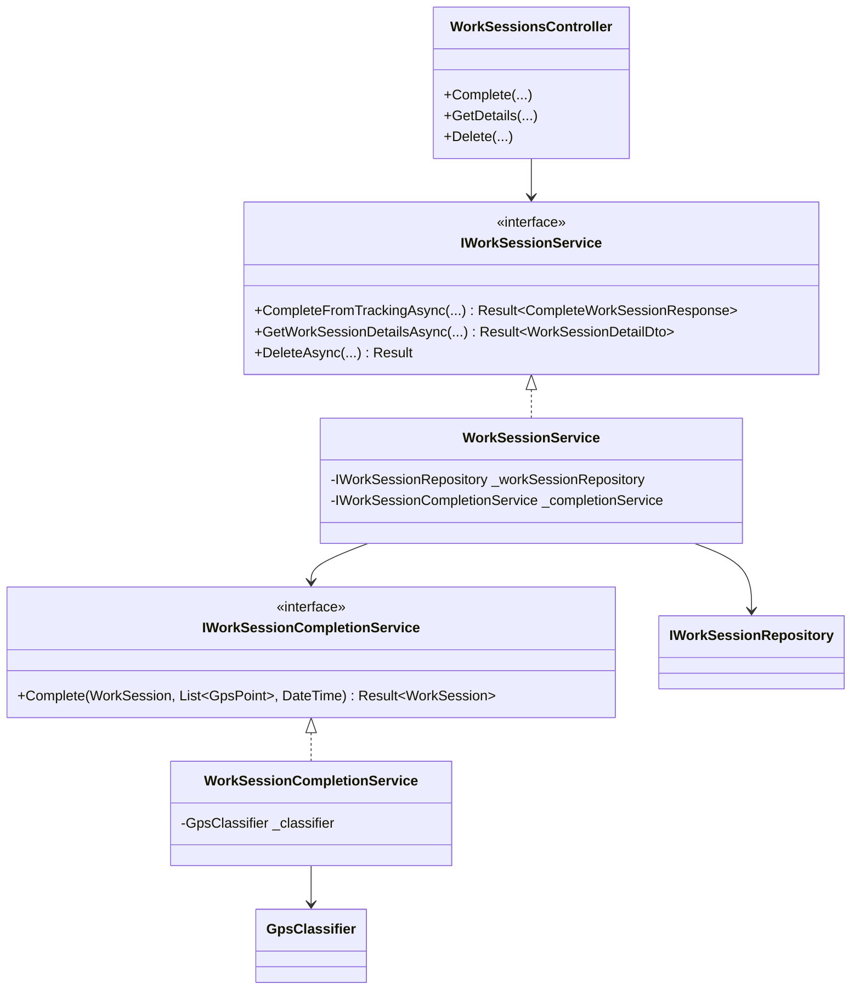

#### Mobile — GPS-tracking

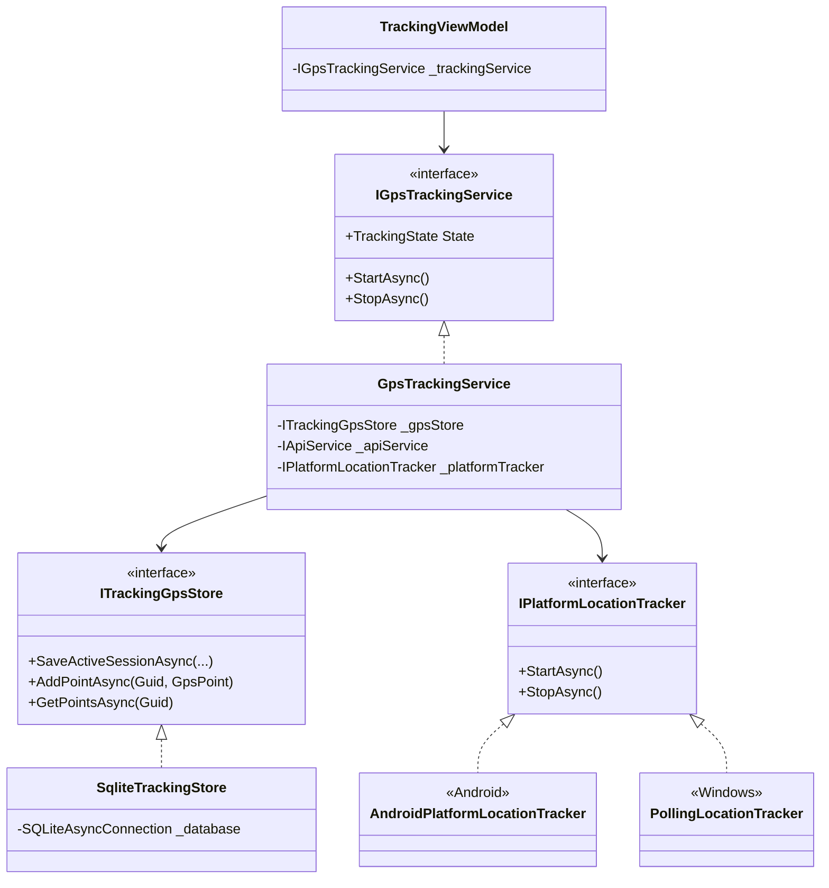

---

### 2.5 Sequence diagram

#### A. Login-flow

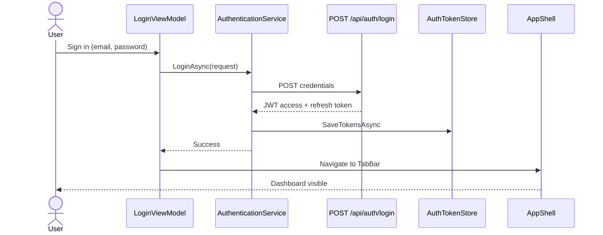

#### B. Tracking-flow

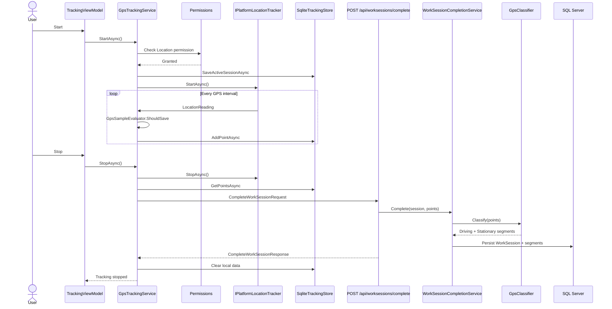

---

### 2.7 Device features & sensoren

| Feature | Implementatie | Platform |
|---------|---------------|----------|
| **GPS** | MAUI `Geolocation` / Android `LocationForegroundService` | Android, Windows |
| **Background tracking** | Android foreground service met persistente notificatie | Android |
| **Locatie-permissies** | `Permissions.LocationWhenInUse` / `LocationAlways` | Android |
| **Notificaties** | Foreground service notification tijdens tracking | Android |
| **Kaart** | MAUI Maps (Android), WebView HTML-map (Windows) | Android, Windows |
| **Lokale opslag** | SQLite (`timeon-tracking-v2.db3`) | Mobile |
| **Preferences** | JWT tokens, development-modus flag | Mobile |

#### Trackingconstanten

Gedefinieerd in `TrackingConstants.cs`:

| Constante | Waarde | Doel |
|-----------|--------|------|
| `MinimumStopDurationMinutes` | 2 minuten | Minimale duur voor stilstaand segment |
| `MaxStationaryDistanceMeters` | 150 m | Maximale spreiding binnen stilstand-window |
| `CustomerProximityRadiusMeters` | 500 m | Radius voor klant-locatie matching |
| `MinRidingSpeedKph` | 10 km/u | Drempel rijsnelheid |

GPS-sample filtering (`TrackingOptions`):

| Optie | Waarde | Doel |
|-------|--------|------|
| `DefaultIntervalSeconds` | 30 s | Standaard polling-interval |
| `FastIntervalSeconds` | 10 s | Interval bij hoge snelheid |
| `MinDistanceMeters` | 25 m | Minimale afstand tussen opgeslagen punten |
| `MaxAccuracyMeters` | 50 m | Maximale GPS-nauwkeurigheid |

#### Target platforms

De mobile app target **Android** en **Windows** (`TimeOn.Mobile.csproj`). Android ondersteunt background tracking via een foreground service; Windows gebruikt polling via `PollingLocationTracker`.

---

## 3. Testresultaten

### 3.1 Unittests API

Unit tests bevinden zich in `tests/TimeOn.UnitTests` en testen Domain- en Application-lagen (auth, klanten, werksessie-domein).

#### Testsuites

| Testsuite | Aantal tests | Onderwerp |
|-----------|--------------|-----------|
| `AuthServiceTests` | 8 | Login, register, refresh, validatiefouten |
| `LoginRequestValidatorTests` | 1 | E-mailvalidatie login-request |
| `RegisterRequestValidatorTests` | 2 | Registratievalidatie |
| `CustomerServiceTests` | 7 | CRUD klanten via `CustomerService` |
| `WorkSessionTests` | 2 | Domain `WorkSession` lifecycle |

**Totaal:** 22 tests

#### Uitvoer (06/06/2026)

```
dotnet test tests/TimeOn.UnitTests
```

| Resultaat | Aantal |
|-----------|--------|
| Passed | 17 |
| Failed | 5 |
| Skipped | 0 |
| Duration | ~700 ms |

**Geslaagde tests:** auth-flow (login, register, refresh), validator-tests, `WorkSessionTests` (start, apply segments).

**GPS-testfixtures:** `tests/TimeOn.UnitTests/Application/WorkSessions/GpsTestData.cs` en bijbehorende expected-data bestanden zijn aanwezig als voorbereiding voor classificatietests.

---

### 3.2 Unittests MAUI

Er is geen apart MAUI/UI-testproject. Mobile-specifieke logica wordt indirect getest via:

- **Domain-laag:** `WorkSessionTests`, GPS-classifier (`GpsClassifier`)
- **Application-laag:** auth- en klantservice-tests
- **Client-side filtering:** `GpsSampleEvaluator` (nog zonder dedicated testklasse)

ViewModels en platform-specifieke code (foreground service, SQLite store) worden getest via handmatige device/emulator-tests.

---

### 3.3 Integratietest

Project `tests/TimeOn.IntegrationTests` is aanwezig als scaffold met referentie naar `TimeOn.Infrastructure` en `Microsoft.AspNetCore.Mvc.Testing`.

<!-- Integratietest resultaten — nog uit te voeren -->

**Geplande scope:**

| Test | Beschrijving |
|------|--------------|
| Auth E2E | Register → login → refresh token via HTTP |
| WorkSession E2E | POST complete met GPS-fixture → GET detail → verify segments |
| Customer E2E | CRUD cyclus via `/api/customers` |
| Authorization | Onbevoegde requests retourneren 401 |

**Status:** projectstructuur aanwezig; testmethoden worden toegevoegd in een volgende iteratie.
